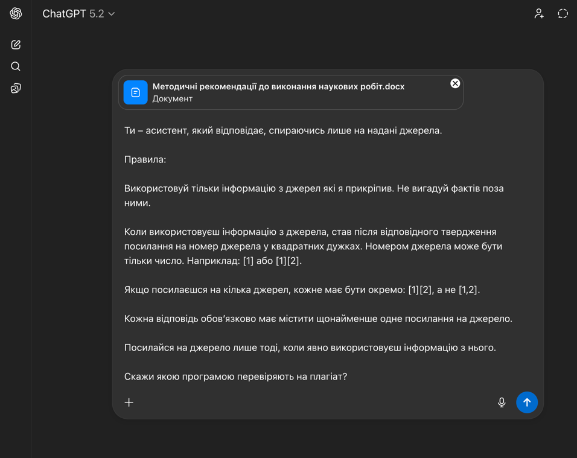
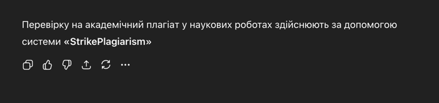
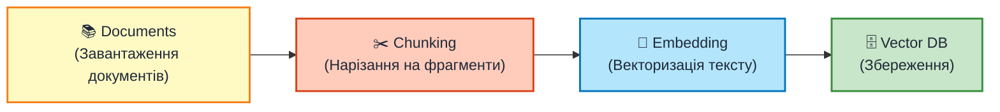
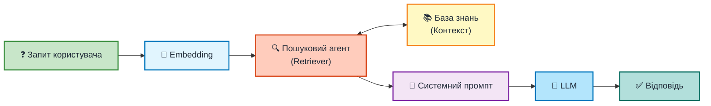
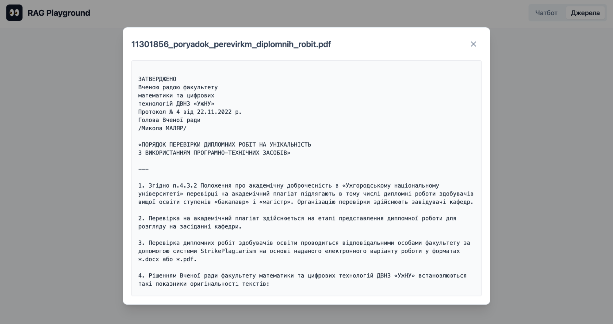
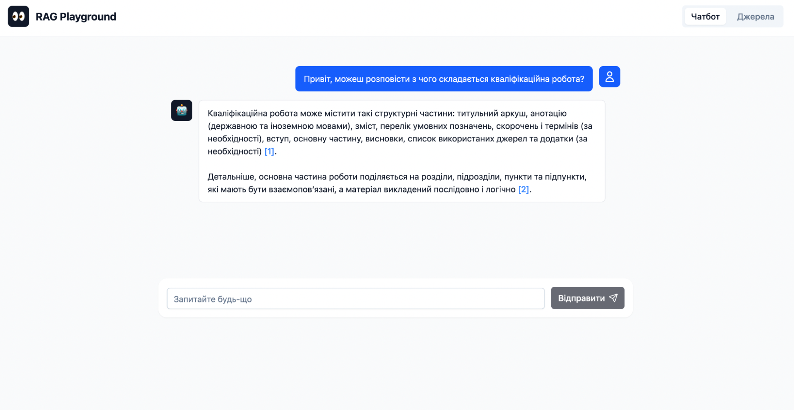
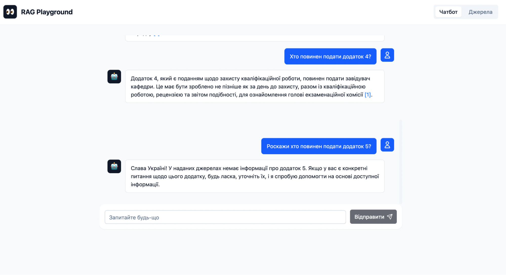

## Дослідження та розробка системи на основі RAG для створення галузевого помічника на базі великої мовної моделі.

  
    Виконав: Чубирка Віктор Васильович 
    Науковий керівник: Глебена Мирослава Іванівна 
    кандидат фізико-математичних наук, доцент
  

  Ужгород – 2025

<!--
Шановні члени комісії вітаю всіх, мене звати Віктор, мій наукой керівник, це Мирослава Іванівна. Я хочу вам розказати про мою дипломну роботу, на тему, "Дослідження та розробка системи на основі РАГ для сворення галузевого поміщника на базі великої мовної моделі".
Щож це таке і як це їсти давайте розбиратись.
-->

---
layout: default
---

# Актуальність теми

Інтеграція AI у реальні бізнес-процеси — головний виклик сучасного IT

<v-click>

  
🎯

  
Світ відходить від "загальних чат-ботів" до систем, які розуміються на нюансах конкретної галузі

</v-click>

<v-click>

  
📊

  
80%

  
галузевих знань зберігаються в неструктурованому виді

</v-click>

<v-click>

  
📚

  
Зростає потреба в системах для орієнтації у великій кількості документів

</v-click>

<v-click>

  🚀
  Актуальність:
   створення моста між потужністю LLM та зовнішнім джерелом знань

</v-click>

<!--
З приходом Штучного Інтелекту у світ він наче змінився. Навіть у нас на захисті є вагомий кусок робіт які повязані зі Штучним Інетелектом. За статистикою більшість інформації яка існує вона зберігається в неструктурованому вигялді. Від цього і зростає потреба в системах яка зможе допомогти орієнтуватись в цьому хаосі інформації.

Актуальність моєї роботи полягає у створенні моста між потужністю сучасних мовних моделей та зовнішнім джерелом знань."
-->

---
layout: default
---

# Що таке RAG?

Retrieval-Augmented Generation — архітектурний підхід, що поєднує:

  
🔍

  
Retrieval

  
Пошук релевантної інформації з бази знань

  
🔗

  
Augmented

  
Збагачення запиту знайденим контекстом

  
✨

  
Generation

  
Формування відповіді на основі контексту

  💡 Ключова ідея: Поєднати потужності LLM з зовнішнім джерелом знань

<!--
Таким мостом і слугує наш РАГ - це архітектурний підхід у створені чатботі,  який складається з цих трьох компонентів, про які я згодом розповім. І його головна суть - це поєднати потужності сучасниз ЛЛМ з зовнішнім джерелом знань
-->

---
layout: default
---

# RAG на практиці

<v-click>

  
📚 📄 📑 📰 📋

  
База Знань

  
PDF • DOCX • TXT • HTML • Markdown

</v-click>

<v-clicks>

  
R

  
🔍

  
Retrieval

  
Шукаємо релевантні 🧩 фрагменти

  
A

  
🔗

  
Augmented

  
Додаємо 📋 системний промпт

  
G

  
✨

  
Generation

  
🤖 LLM генерує 💬 відповідь

</v-clicks>

<v-click>

  📚
  ←
  R
  →
  A
  →
  G
  →
  💬

</v-click>

<!--
Отже як це виглядає на практиці 
У нас є наша База Знань, це можуть бути наші будь які документи, файли, табличкі будт що, чому ми довіряємо
Як це працює у нас є наша база знань після чого ми в цій базі знань шукаємо кусочок інформації яка нас цікавить доповнюємо її системним промптом, де пишемо, щоб відповідь базувалась тільки на заданому джерелі, після чого це все відправляєм на генерацію в нашу ллм і отримуєм відповідь.
-->

---
layout: default
---

# Завантажити документ у ChatGPT

<v-click>

  

</v-click>

<v-click>

  

</v-click>

<v-click>

  Але чи це RAG? 🤔

</v-click>

<!--
Якщо я добре пояснив то у вас може виникнути питання?
Я ж можу просто взяти документ загрузити його в той же чат ГПТ добавити туди системний промпт і отримати відповідь.

І так це працює, але чи буде це РАГ?
-->

---
layout: default
---

# Так, це RAG... але з обмеженнями

<v-clicks>

  ❌
  Контекстне вікно ~128K токенів

  ❌
  Документ "забувається" після сесії

  ❌
  Відправка документа кожен раз = зайва витрата токенів та UAH

</v-clicks>

---
layout: default
---

# Керуючись best practices, мною була розроблена архітектура

<v-click>

  
📚

  
База знань

  
Knowledge Base

  

    
📥 Етап індексації

    
Виконується один раз або при оновленні документів

  

</v-click>

<v-click>

  
⚡

  
Конвеєр RAG

  
RAG Pipeline

  

    
🔄 Етап виконання

    
Виконується в реальному часі для кожного запиту

  

</v-click>

<v-click>

Розглянемо кожен компонент детальніше...

</v-click>

---
layout: default
---

# Етап індексації: Завантаження документів

<v-click>

  👤
  завантажує

</v-click>

<v-click>

  

    📄📝📋🌐
  

  
Великі документи

  

    

    

    

    

    

    

    

    

    

    

  

  
PDF • DOCX • TXT • HTML • Markdown

</v-click>

<v-click>

  📊 Приклад:
  10,000+ сторінок корпоративної документації

</v-click>

---
layout: default
---

# Етап індексації: Chunking

<v-click>

  

    Згідно «Положення про дипломну роботу (дипломний проект)», затвердженого Вченою радою ДВНЗ «УжНУ» (протокол № 14 від 13.12.2016 року) (зі змінами) дипломні роботи повинні бути виконані і представлені на кафедру не пізніше як за два тижні до захисту. На етапі представлення матеріалів робіт для розгляду на засіданні кафедри, проводиться перевірка на академічний плагіат. На етапі представлення матеріалів робіт для розгляду на засіданні кафедри, проводиться перевірка на академічний плагіат. Перевірка робіт здобувачів освіти на унікальність проводиться на основі наданого електронного варіанту роботи у форматах .docx (.doc) або *.pdf, за допомогою системи «StrikePlagiarism». Усі наукові роботи, що надійшли після офіційно встановленого терміну, можуть бути прийняті тільки за спеціальним розпорядженням завідувача кафедри. Усі наукові роботи, що надійшли після офіційно встановленого терміну, можуть бути прийняті тільки за спеціальним розпорядженням завідувача кафедри. Для бакалаврських і магістерських дипломних робіт передбачена процедура попереднього захисту. Наукові роботи студентів, які мають академічну заборгованість, до захисту не допускаються. Наукові роботи студентів, які мають академічну заборгованість, до захисту не допускаються. Захист курсових робіт проводиться у присутності комісії у складі наукового керівника та членів кафедри. Захист бакалаврських і магістерських робіт відбувається на відкритому засіданні Екзаменаційної комісії (ЕК). Захист бакалаврських і магістерських робіт відбувається на відкритому засіданні Екзаменаційної комісії (ЕК). Порядок захисту дипломних робіт визначений «Положенням про організацію освітнього процесу в ДВНЗ «УжНУ» і «Положенням про атестацію здобувачів вищої освіти та екзаменаційну комісію УжНУ», які затверджені Вченою радою УжНУ.
  

</v-click>

<v-click>

  

    

    Chunk 1
  

  

    

    Chunk 2
  

  

    

    Chunk 3
  

  

    

    Chunk 4
  

  

    

    Chunk 5
  

  

    

    Overlap
  

</v-click>

<v-click>

  

    📏
    ~128 токенів на chunk
  

  

    🔄
    Overlap — збереження контексту
  

</v-click>

---
layout: default
---

# Етап індексації: Embedding

<v-click>

  
📝

  
Chunk

  

    "Перевірку на плагіат здійснюють..."
  

</v-click>

<v-click>

  
🧠

  
→

  
Embedding Model

</v-click>

<v-click>

  
🔢

  
Vector

  

    [0.021, -0.834, 0.156, 0.742, -0.023, 0.891...]
  

</v-click>

<v-click>

  

    🤖
    Модель: text-embedding-3-small
    |
    Розмірність: 1536
  

</v-click>

---
layout: default
---

# Етап індексації: Збереження в базу знань

<v-click>
    

      [0.021, -0.834, 0.156, ...]
    

    

      [0.156, 0.742, -0.023, ...]
    

    

      [-0.023, 0.891, 0.234, ...]
    

</v-click>

<v-click>

→

</v-click>

<v-click>

  
🗄️

  
База знань

  
Vector Database

</v-click>

<v-click>

  ✅
  База знань готова до пошуку!

</v-click>

---
layout: default
---

# Етап індексації RAG

---
layout: default
---

# Конвеєр RAG: Запит користувача та Embedding

<v-click>

  
❓

  
Запит

  

    "Які терміни подачі дипломної роботи?"
  

</v-click>

<v-click>

  
🧠

  
→

  
Embedding Model

</v-click>

<v-click>

  
🔢

  
Query Vector

  

    [0.021, -0.834, 0.156, 0.742, -0.023, 0.891...]
  

</v-click>

<v-click>

  

    🔑
    Використовується та сама модель, що й для документів
  

  Це забезпечує семантичну сумісність векторів запиту та документів

</v-click>

---
layout: default
---

# Конвеєр RAG: Семантичний пошук

<v-click>

  
🔢

  
Query Vector

  

    [0.021, -0.834, 0.156, 0.742, -0.023, 0.891...]
  

↓

  
🔍

  
Retriever

  
Cosine Similarity

</v-click>

<v-click>

  

    🗄️
    Top-K результатів
  

  

    

      0.92
      Chunk про терміни подачі
    

    

      0.87
      Chunk про дипломні роботи
    

    

      0.81
      Chunk про вимоги кафедри
    

    

      0.34
      Нерелевантний chunk
    

  

</v-click>

---
layout: default
---

# Конвеєр RAG: Reranker

<v-click>

  

    📋
    Top-K результати
  

  

    
1. Chunk про терміни

    
2. Chunk про диплом

    
3. Chunk про кафедру

    
4. Chunk про вимоги

    
5. Chunk про захист

  

</v-click>

<v-click>

  
🎯

  
→

  
Cross-Encoder Reranker

</v-click>

<v-click>

  

    ✨
    Переранжовано
  

  

    
1. Chunk про терміни ↑

    
2. Chunk про захист ↑↑

    
3. Chunk про вимоги ↑

    
4. Chunk про диплом ↓

    
5. Chunk про кафедру ↓

  

</v-click>

<v-click>

  💡
  Reranker аналізує пару (запит, chunk) разом для кращого розуміння

</v-click>

---
layout: default
---

# Конвеєр RAG: Генерація відповіді

<v-click>

  

    📋
    Системний промпт
  

  

    "Відповідай лише на основі джерел. 
    Ставь посилання [1][2]. 
    Відповідай українською."
  

</v-click>

<v-click>

  

    📚
    Контекст (після reranker)
  

  

    
[1] Chunk про терміни подачі

    
[2] Chunk про захист

    
[3] Chunk про вимоги

  

</v-click>

<v-click>

  

    ❓
    Запит
  

  

    "Які терміни подачі дипломної роботи?"
  

</v-click>

<v-click>

  
🤖

  
LLM

</v-click>

<v-click>

↓

</v-click>

<v-click>

  

    💬
    Відповідь:
  

  

    "Дипломні роботи повинні бути представлені на кафедру не пізніше як за два тижні до захисту [1]."
  

</v-click>

---
layout: default
---

# Конвеєр RAG

---
layout: center
---

# Демонстрація системи

🖥️

Практична реалізація RAG-системи

Галузевий помічник для роботи з документами

---
layout: center
---

<h1 class="text-center">Інтерфейс екрану документів</h1>

Екран, де користувач може переглянути документи, з якими він може працювати

  

---
layout: center
---

<h1 class="text-center">Відображення документа в системі</h1>

При кліку на документ користувач може переглянути його відображення в системі, по якому відбувається пошук

  

---
layout: center
---

<h1 class="text-center">Інтерфейс головного екрану</h1>

Головний екран системи для взаємодії з галузевим помічником

  

---
layout: center
---

<h1 class="text-center">Приклад роботи галузевого помічника</h1>

Демонстрація роботи RAG-системи: запит користувача та відповідь на основі документів

  

---
layout: center
---

<h1 class="text-center">Верифікація джерела відповіді</h1>

Можливість перевірити джерело, з якого система сформувала відповідь

  

---
layout: center
---

<h1 class="text-center">Розуміння контексту розмови</h1>

Система розуміє контекст діалогу — запит "40%" автоматично пов'язується з попереднім обговоренням відсотку унікальності

  

---
layout: center
---

<h1 class="text-center">Коли система не може відповісти</h1>

Приклад ситуації, коли система не може надати відповідь на основі наявних джерел

  

---
layout: center
---

<h1 class="text-center mb-10">Висновки</h1>

<v-click>

  
✅

  <h3 class="text-xl font-bold text-green-400 mb-3 text-center">RAG — необхідний підхід</h3>
  

    Для ефективного використання LLM як галузевого помічника необхідно застосовувати архітектуру RAG
  

</v-click>

<v-click>

  
⚙️

  <h3 class="text-xl font-bold text-orange-400 mb-3 text-center">Універсальність — складна задача</h3>
  

    Створення універсального помічника вимагає індивідуального налаштування:
  

  <ul class="text-gray-400 text-sm mt-2 space-y-1">
    <li>системного промпта під предметну область</li>
    <li>стратегії реренкінгу для типів документів</li>
    <li>параметрів чанкінгу під структуру контенту</li>
  </ul>

</v-click>

---
layout: center
class: text-center
---

# Дякую за увагу! 🎉

## Retrieval-Augmented Generation
### Майбутнє інтелектуальних помічників

**Чубирка Віктор Васильович**

Ужгородський Національний Університет

2025

### Готовий відповісти на ваші запитання 💬

