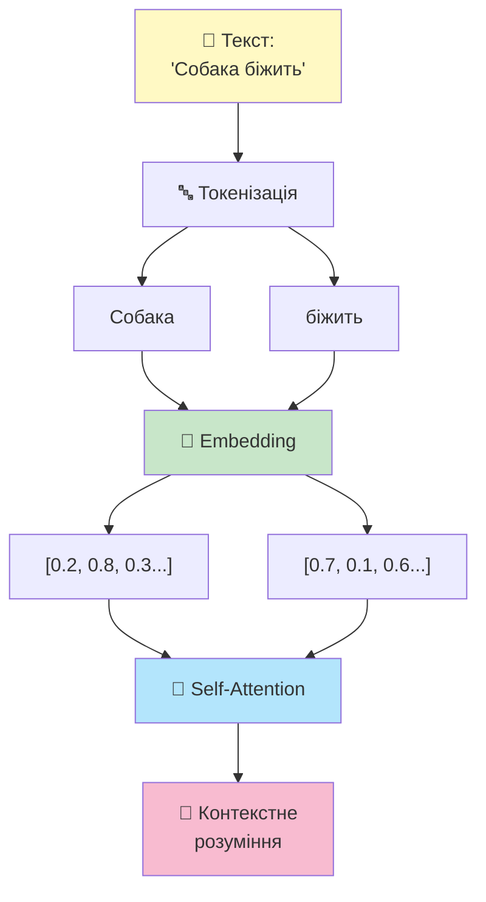
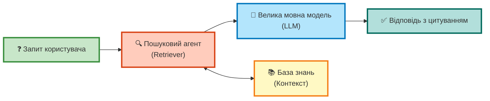
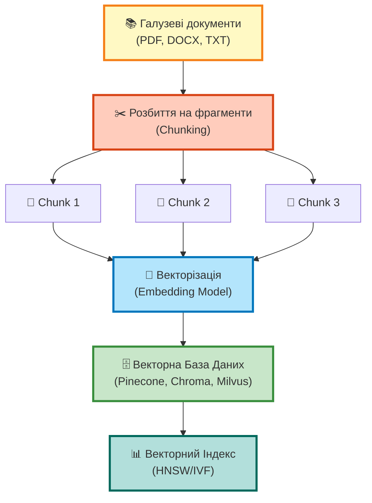
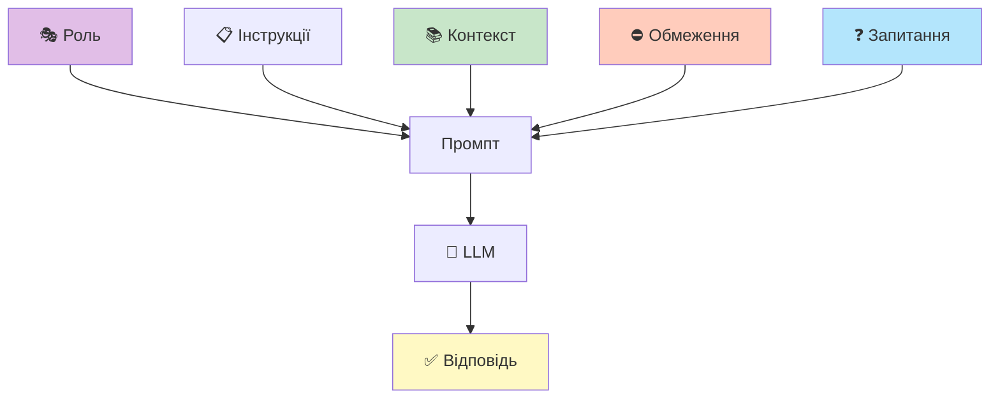
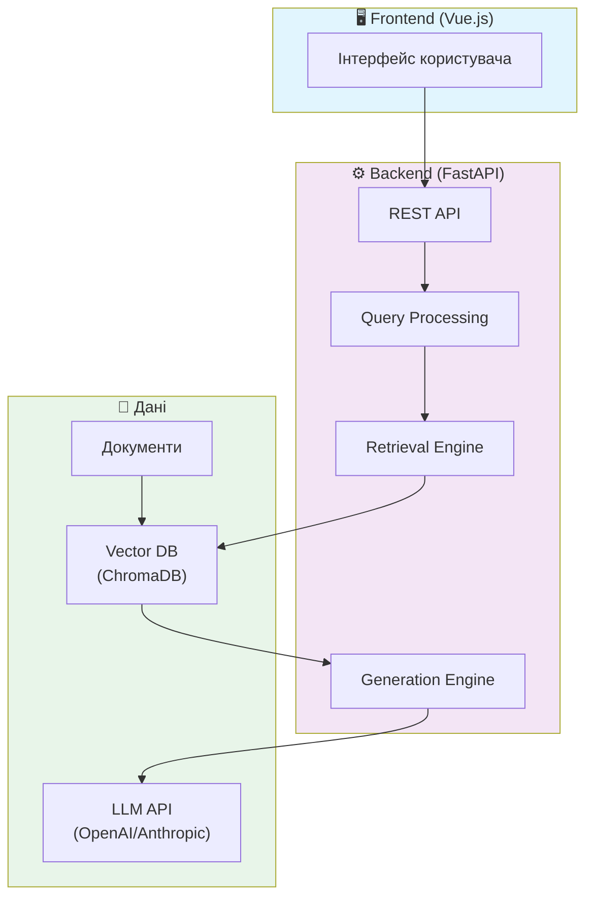

# Дослідження та розробка системи на основі RAG

## Retrieval-Augmented Generation для створення галузевого помічника

  
    Виконав: Чубирка Віктор Васильович 
    Науковий керівник: Глебена Мирослава Іванівна 
    кандидат фізико-математичних наук, доцент
  

  Ужгород – 2025

---
layout: default
---

# Актуальність теми

## 🎯 Проблема

<v-clicks>

- 🤖 **Великі мовні моделі (LLM)** - потужний інструмент
- ⚠️ **Галюцинації** - генерація недостовірної інформації
- 📅 **Knowledge Cutoff** - застарілість знань
- 🏢 **Відсутність доступу** до приватних даних
- ❓ **Неможливість верифікації** джерел

</v-clicks>

## ✨ Рішення

<v-clicks>

- 📚 **RAG** - Retrieval-Augmented Generation
- 🔍 Поєднання LLM з **зовнішніми джерелами знань**
- ✅ Підвищення **точності відповідей**
- 📖 **Прозоре цитування** джерел
- 🎓 Створення **галузевих помічників**

</v-clicks>

---
layout: default
---

# Мета та завдання дослідження

## 🎯 Мета роботи

Дослідження підходів Retrieval-Augmented Generation та розробка програмного прототипу **галузевого помічника** на основі LLM з інтеграцією зовнішніх джерел знань

## 📋 Основні завдання

<v-clicks>

1. Проаналізувати архітектурні особливості сучасних LLM
2. Дослідити обмеження LLM та обґрунтувати переваги RAG-систем
3. Розробити концептуальну та технічну архітектуру галузевого помічника
4. Реалізувати програмний прототип з механізмами індексації та пошуку
5. Провести експериментальну оцінку точності та продуктивності системи

</v-clicks>

---
layout: section
---

# РОЗДІЛ 1
## Теоретичні основи технології LLM

---
layout: two-cols
---

# Архітектура Transformer

## 🧠 Ключові компоненти

<v-clicks>

1. **Токенізація**
   - Розбиття тексту на токени
   - Мінімальні одиниці інформації

2. **Vector Embedding**
   - Векторне представлення слів
   - Семантична близькість

3. **Self-Attention**
   - Оцінка важливості слів
   - Розуміння контексту

</v-clicks>

::right::

<v-click>
Слова з близьким значенням мають схожі вектори
</v-click>

---
layout: default
---

# Обмеження базових LLM

### 🔴 Knowledge Cutoff

<v-clicks>

- Знання обмежені датою тренування
- Немає інформації про нові події
- Застаріла статистика
- Старі версії технологій

</v-clicks>

### 🟠 Галюцинації

<v-clicks>

- Генерація вигаданих фактів
- Правдоподібні, але хибні твердження
- Немає механізму верифікації
- Ризик для критичних систем

</v-clicks>

### 🟡 Приватні дані

<v-clicks>

- Тренування на публічних даних
- Відсутність корпоративних знань
- Незнання галузевої термінології
- Обмеження контекстного вікна

</v-clicks>

<v-click>

## ✅ RAG вирішує всі ці проблеми

</v-click>

---
layout: default
---

# Концепція RAG

<v-click>

### 🎯 Основна ідея
Перед генерацією відповіді LLM **отримує релевантну інформацію** з бази знань

</v-click>

<v-click>

### ✨ Переваги
- Актуальність даних
- Фактична точність
- Прозорість джерел
- Контроль контексту

</v-click>

<v-click>

### 🚀 Результат
**Достовірні відповіді** з посиланнями на першоджерела

</v-click>

---
layout: default
---

# Етап індексації RAG

<v-click>

<b>1️⃣ Джерела</b> 
Збір документів

</v-click>

<v-click>

<b>2️⃣ Chunking</b> 
Розбиття на фрагменти

</v-click>

<v-click>

<b>3️⃣ Embedding</b> 
Векторизація тексту

</v-click>

<v-click>

<b>4️⃣ Індекс</b> 
Швидкий пошук

</v-click>

---
layout: section
---

# РОЗДІЛ 2
## Методологія оптимізації RAG-систем

---
layout: default
---

# Query Processing - Обробка запиту

### 🎯 Intent Detection
**Визначення наміру користувача**

| Запит | Намір |
|-------|-------|
| "Порівняй Python та Java" | Порівняння |
| "Скільки кг у тонні?" | Факт |
| "Підсумуй статтю про..." | Узагальнення |

<v-click>

### 🔄 Query Rewriting
**Переписування нечітких запитів**

| Оригінал | Переписаний |
|----------|-------------|
| "Як це працює?" | "Поясни роботу Модуля X в Системі Y" |

</v-click>

<v-click>

### ➕ Query Expansion
**Розширення синонімами**

| Запит | Розширення |
|-------|------------|
| "Не працює світло" | "зникла електрика" "вибило пробки" "відсутня напруга" |

</v-click>

<v-click>

### 🔀 Query Decomposition
**Розбиття складних запитів**

**Складний:** "Які вимоги до пам'яті та чи підтримує Linux?"

**Підзапити:**
1. Вимоги до пам'яті?
2. Підтримка Linux?

</v-click>

---
layout: default
---

# Retrieval Optimization - Пошук

### 🏷️ Metadata Filtering

<v-clicks>

**Фільтрація за атрибутами**
- Дата створення
- Тип документа
- Рівень доступу
- Відділ/автор

</v-clicks>

<v-click>

<b>Приклад:</b> "Накази по відпустках за 2024" 
✅ Фільтр: <code>year: 2024, type: "наказ"</code>

</v-click>

### 🔀 Hybrid Search

<v-click>

**Поєднання двох підходів:**

</v-click>

<v-clicks>

1. **BM25 (Keyword)**
   - Точні співпадіння
   - Номери, коди, назви

2. **Vector Search (Semantic)**
   - Розуміння сенсу
   - Синоніми, контекст

</v-clicks>

<v-click>

<b>Результат:</b> Знаходить документи які: 
✅ Концептуально відповідають 
✅ Містять точні терміни

</v-click>

---
layout: default
---

# Re-ranking - Переранжування

## 🎯 Проблема
Після гібридного пошуку маємо **багато кандидатів**, але не всі релевантні

## ⚙️ Рішення: Cross-Encoder

<v-clicks>

1. **Попередній відбір:** Швидкий пошук → Топ-50 кандидатів
2. **Глибоке оцінювання:** Cross-Encoder аналізує кожен фрагмент
3. **Точне ранжування:** Залишає тільки 5-10 найкращих

</v-clicks>

<v-click>

### 📊 Приклад: "Які штрафи за порушення термінів подачі звіту?"

<b>❌ До Re-ranking:</b>
<ol class="text-sm">
<li>Правила подачі звіту</li>
<li>Історія змін у звітності</li>
<li>...(позиція 35) Таблиця санкцій</li>
</ol>

<b>✅ Після Re-ranking:</b>
<ol class="text-sm">
<li><b>Таблиця санкцій</b> ← найрелевантніше!</li>
<li>(інші відсіяні)</li>
</ol>

</v-click>

---
layout: default
---

# Generation Optimization - Генерація

### 📝 System Prompt Engineering

<v-click>

**Критичні обмеження:**
- ❌ Не галюцинувати
- ✅ Тільки наданий контекст
- 📖 Якщо немає відповіді - повідомити

</v-click>

<v-click>

### 📖 Citation Addition

**Додавання посилань на джерела**

<b>Запит:</b> "Термін гарантії на компресор?"

<b>Відповідь з атрибуцією:</b>

Гарантійний термін становить **24 місяці** *[Гарантійний_талон_2024.pdf, стор. 2]*.

При використанні неоригінального мастила - **6 місяців** *[Інструкція_експлуатації.docx, розділ 4.1]*.

</v-click>

<v-click>

<b>✨ Переваги:</b> 
✅ Прозорість 
✅ Можливість верифікації 
✅ Довіра користувачів

</v-click>

---
layout: section
---

# РОЗДІЛ 3
## Практична реалізація системи

---
layout: default
---

# Архітектура розробленої системи

<v-click>

<b>Frontend</b> 
Vue.js, TypeScript 
Інтерактивний UI

</v-click>

<v-click>

<b>Backend</b> 
FastAPI, Python 
RAG Pipeline

</v-click>

<v-click>

<b>Дані</b> 
ChromaDB 
OpenAI Embeddings

</v-click>

---
layout: default
---

# Ключові компоненти реалізації

### 🔍 Підсистема пошуку

<v-clicks>

- **Semantic Chunking**
  - Розумне розбиття тексту
  - Збереження контексту

- **Hybrid Search**
  - BM25 + Vector Search
  - Оптимальна релевантність

- **Re-ranking**
  - Cross-Encoder моделі
  - Фінальна фільтрація

</v-clicks>

### 🤖 Модуль генерації

<v-clicks>

- **Prompt Engineering**
  - Динамічні системні промпти
  - Context Injection

- **Citation System**
  - Автоматичне додавання джерел
  - Метадані документів

- **Post-processing**
  - Форматування відповідей
  - Виявлення галюцинацій

</v-clicks>

<v-click>

## 🎯 Результат реалізації

**Працюючий прототип** галузевого помічника з можливістю:
- ✅ Точного пошуку інформації в документах
- ✅ Генерації відповідей з цитуванням джерел
- ✅ Роботи з різними типами документів
- ✅ Інтуїтивного веб-інтерфейсу

</v-click>

---
layout: section
---

# Висновки

---
layout: default
---

# Висновки та результати

## ✅ Виконані завдання

<v-clicks>

1. **Досліджено архітектуру LLM**
   - Transformer, Attention
   - Обмеження та проблеми

2. **Обґрунтовано переваги RAG**
   - Актуальність даних
   - Верифікація фактів

3. **Розроблено архітектуру**
   - Модульна структура
   - Оптимізований pipeline

4. **Реалізовано прототип**
   - Індексація документів
   - Гібридний пошук
   - Генерація з цитуванням

</v-clicks>

<v-click>

## 🎯 Практична цінність

**Створено функціонуючу систему** яка:

- 📚 Працює з галузевими документами
- 🔍 Знаходить релевантну інформацію
- ✅ Генерує точні відповіді
- 📖 Цитує джерела
- 🚀 Легко масштабується

</v-click>

<v-click>

## 🔮 Перспективи розвитку

- 🤖 Агентські системи (Agentic RAG)
- 🛠️ Function Calling
- 📊 Автоматична оцінка якості
- 🌐 Багатомовна підтримка
- 🔐 Розширена безпека

</v-click>

---
layout: center
class: text-center
---

# Дякую за увагу! 🎉

## Retrieval-Augmented Generation
### Майбутнє інтелектуальних помічників

**Чубирка Віктор Васильович**

Ужгородський Національний Університет

2025

### Готовий відповісти на ваші запитання 💬

