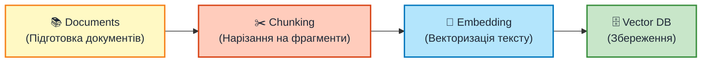
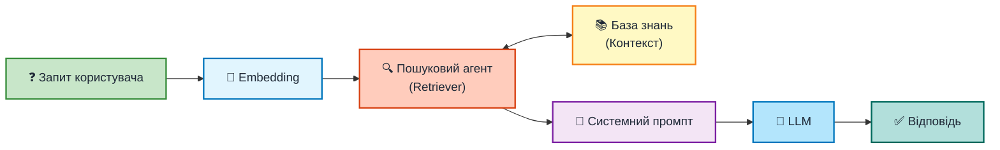
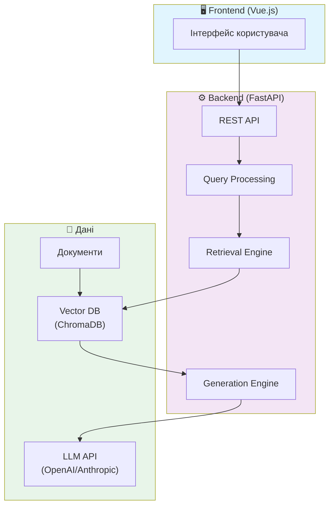

## Дослідження та розробка системи на основі RAG для створення галузевого помічника на базі великої мовної моделі.

  
    Виконав: Чубирка Віктор Васильович 
    Науковий керівник: Глебена Мирослава Іванівна 
    кандидат фізико-математичних наук, доцент
  

  Ужгород – 2025

---
layout: default
---

# Актуальність теми

Інтеграція AI у реальні бізнес-процеси — головний виклик сучасного IT.

<v-clicks>

*  Світ відходить від "загальних чат-ботів" до вузькопрофільних асистентів, які розуміють специфіку конкретної галузі.
*  Близько **80%** галузевиз знань зберігаються в неструктурованому виді, які складно використовувати для швидкого пошуку.
*  Зростає потреба в системах, які можуть автоматично обробляти складні запити клієнтів без залучення людини-оператора.

</v-clicks>

<v-click>

> **🚀Актуальність полягає:** у створенні моста між потужністю великих мовних моделей та специфічними, закритими даними підприємства.

</v-click>

---
layout: default
---

# Переваги LLM

## 🚀 Переваги LLM

<v-clicks>

- 🎯 **Універсальність** - один інструмент для багатьох задач
- 🧠 **Контекстне розуміння** - аналіз нюансів мови
- 💬 **Легкість використання** - взаємодія природною мовою
- 🚀 **Zero/Few-shot** - виконання нових задач без перенавчання
- 🌍 **Багатомовність** - підтримка десятків мов

</v-clicks>

## 📋 Сфери застосування

<v-clicks>

- 📝 **Генерація контенту** - тексти, маркетинг, звіти
- 🤖 **Інтелектуальні чат-боти**
- 📋 **Узагальнення** - резюме документів
- 🌐 **Машинний переклад** 
- 💻 **Написання коду** 

</v-clicks>

<v-click>

### 🤔 Але чи можуть LLM замінити експертів у спеціалізованих галузях?

</v-click>

---
layout: default
---

# Обмеження базових LLM

## ⚙️ Технічні обмеження

<v-clicks>

- 📅 **Knowledge Cutoff** - знання обмежені датою тренування
- 🔒 **Приватні дані** - немає доступу до корпоративних документів
- 📏 **Контекстне вікно** - обмежений обсяг вхідних даних
- 🎓 **Галузева специфіка** - незнання вузької термінології

</v-clicks>

## ⚠️ Проблеми достовірності

<v-clicks>

- 🟠 **Галюцинації** - генерація вигаданих фактів
- ❓ **Неможливість верифікації** - немає посилань на джерела
- 📊 **Застаріла статистика** - неактуальні числові дані
- 🚨 **Правдоподібні, але хибні твердження** 

</v-clicks>

<v-click>

### 📋 Подивимось на конкретні приклади

</v-click>

---
layout: default
---

# Типові сценарії невдач

<v-click>

❌ Запит:

"Які останні новини про компанію X?"

→ LLM не знає актуальних подій

🔴 Knowledge Cutoff

</v-click>

<v-click>

❌ Запит:

"Знайди в інструкції термін гарантії"

→ LLM не має доступу до документів

🟡 Приватні дані

</v-click>

<v-click>

❌ Запит:

"Яка статистика продажів за Q3 2024?"

→ LLM може вигадати дані

🟠 Галюцинації

</v-click>

<v-click>

❌ Запит:

"Що таке КЗ-5 у нашому регламенті?"

→ LLM не знає внутрішніх скорочень

🔵 Галузева термінологія

</v-click>

<v-click>

❌ Запит:

"Дай посилання на джерело цієї інформації"

→ LLM не може підтвердити інформацію

❓ Неможливість верифікації

</v-click>

<v-click>

### 💡 Як RAG вирішує ці проблеми?

</v-click>

---
layout: default
---

# RAG вирішує ці проблеми

<v-click>

🔴 Knowledge Cutoff

Застарілі знання

⬇️

📚 Актуальна база знань

Оновлення в реальному часі

</v-click>

<v-click>

🟠 Галюцинації

Вигадані факти

⬇️

📖 Цитування джерел

Верифіковані відповіді

</v-click>

<v-click>

🟡 Приватні дані

Немає доступу

⬇️

🏢 Корпоративні документи

Повна інтеграція

</v-click>

<v-click>

### 🎯 RAG = Retrieval-Augmented Generation
**Поєднання потужності LLM з достовірними джерелами знань**

</v-click>

---
layout: default
---

# Типова архітектура RAG складається з **двох ключових компонентів**:

<v-click>

### 📚 База знань (Knowledge Base)

**Етап індексації** — підготовка даних

Виконується один раз або при оновленні документів

</v-click>

<v-click>

### ⚡ Конвеєр RAG (RAG Pipeline)

**Етап виконання** — обробка запитів

Виконується в реальному часі для кожного запиту

</v-click>

<v-click>

Розглянемо кожен компонент детальніше...

</v-click>

---
layout: default
---

# Етап індексації RAG

---
layout: default
---

# Конвеєр RAG

---
layout: default
---

# Оптимізація RAG: 3 етапи покращення

Базовий RAG працює, але для **надійного галузевого помічника** потрібна оптимізація на кожному етапі

<v-click>

### 1️⃣ Query Processing

**Обробка запиту**

*"Як це працює?"* → *"Поясни роботу модуля X в системі Y"*

Intent Detection, Query Rewriting, Query Expansion

</v-click>

<v-click>

### 2️⃣ Retrieval

**Пошук**

*Знайти саме ті фрагменти, де є відповідь*

Hybrid Search, Metadata Filtering, Re-ranking

</v-click>

<v-click>

### 3️⃣ Generation

**Генерація**

*Відповідь: "Термін гарантії 24 міс." [doc.pdf, стор.2]*

Prompt Engineering, Citation Addition

</v-click>

<v-click>

Розглянемо кожен етап детальніше...

</v-click>

---
layout: default
---

# 1️⃣ Query Processing - Обробка запиту

Перетворення нечіткого запиту користувача на точний пошуковий вектор

<v-click>

### 🔄 Переписати запит

*"Як це працює?"* → *"Поясни роботу модуля X"*

</v-click>

<v-click>

### ➕ Розширити синонімами

*"Не працює світло"* → *"зникла електрика", "вибило пробки"*

</v-click>

<v-click>

<v-click>

### 🎯 Визначити намір

*"Порівняй Python та Java"* → **Порівняння**
*"Підсумуй документ"* → **Узагальнення**

</v-click>

### 🔀 Розбиття на підзапити

*"Ціна товару X та умови доставки?"*
→ 1. Ціна? 2. Доставка?

</v-click>

---
layout: default
---

# 2️⃣ Retrieval Optimization - Пошук

Максимізація релевантності результатів пошуку

### 🏷️ Metadata Filtering

<v-clicks>

**Фільтрація за атрибутами**

</v-clicks>

<v-click>

<b>📅 За датою:</b> "Накази за 2024" → <code class="text-gray-200">year: 2024</code>

</v-click>

<v-click>

<b>👤 За роллю:</b> "Інструкція для менеджерів" → <code class="text-gray-200">role: manager</code>

</v-click>

<v-click>

<b>🔢 За версією:</b> "Документація v2.5" → <code class="text-gray-200">version: 2.5</code>

</v-click>

<v-click>

<b>🔒 За доступом:</b> "Конфіденційні звіти" → <code class="text-gray-200">access: confidential</code>

</v-click>

### 🔀 Hybrid Search

<v-click>

**Поєднання двох підходів:**

</v-click>

<v-clicks>

1. **BM25 (Keyword)**
   - Точні співпадіння
   - Номери, коди, назви

2. **Vector Search (Semantic)**
   - Розуміння сенсу
   - Синоніми, контекст

</v-clicks>

<v-click>

<b>Результат:</b> Знаходить документи які: 
✅ Концептуально відповідають запиту 
✅ Містять точні терміни

</v-click>

---
layout: default
---

# Re-ranking - Переранжування

## 🎯 Проблема
Після гібридного пошуку маємо **багато кандидатів**, але не всі релевантні

## ⚙️ Рішення: Cross-Encoder

<v-clicks>

1. **Попередній відбір:** Швидкий пошук → Топ-50 кандидатів
2. **Глибоке оцінювання:** Cross-Encoder аналізує кожен фрагмент
3. **Точне ранжування:** Залишає тільки 5-10 найкращих

</v-clicks>

<v-click>

### 📊 Приклад: "Які штрафи за порушення термінів подачі звіту?"

<b>❌ До Re-ranking:</b>
<ol class="text-sm">
<li>Правила подачі звіту</li>
<li>Історія змін у звітності</li>
<li>...(позиція 35) Таблиця санкцій</li>
</ol>

<b>✅ Після Re-ranking:</b>
<ol class="text-sm">
<li><b>Таблиця санкцій</b> ← найрелевантніше!</li>
<li>(інші відсіяні)</li>
</ol>

</v-click>

---
layout: default
---

# 3️⃣ Generation - Prompt Engineering

Як змусити LLM правильно інтерпретувати знайдену інформацію

<v-click>

🎭

Роль

"Ти — галузевий експерт з технічної підтримки"

</v-click>

<v-click>

📋

Інструкції

Формат відповіді, стиль, мова

</v-click>

<v-click>

📚

Контекст

Знайдені фрагменти документів

</v-click>

<v-click>

⛔

Заборони

"Не вигадуй! Тільки з контексту!"

</v-click>

<v-click>

📖

Цитування

"Вказуй джерело кожного факту"

</v-click>

<v-click>

Роль: Ти — експерт технічної підтримки. Твоя задача допомагати користувачам з їх питаннями 
Інструкції: Відповідай лаконічно. Обовязково цитуй джерела. 
Контекст: Контекст: [Знайдені документи] 
Обмеження: Відповідай тільки з контексту! Якщо джерел не знайдено, то так і скажи 
Запит: Питання користувача: [Запит користувача]

</v-click>

---
layout: default
---

# 3️⃣ Generation - Приклад відповіді

<b>❓ Запит:</b> "Коли починається зимова сесія для 5 курсу?"

<v-click>

✅ Відповідь системи:

Зимова екзаменаційна сесія для студентів **5 курсу** розпочинається **13 січня 2025 року** та триватиме до 26 січня.

📎 [Графік_навчального_процесу_2024-2025.pdf, стор. 3]

Розклад екзаменів буде опубліковано на сайті факультету не пізніше ніж за **2 тижні** до початку сесії.

📎 [Положення_про_організацію_освітнього_процесу.docx, п. 5.4]

</v-click>

<v-click>

✅ Точна відповідь

✅ Цитати джерел

✅ Без галюцинацій

</v-click>

---
layout: section
---

# РОЗДІЛ 3
## Практична реалізація системи

---
layout: default
---

# Архітектура розробленої системи

<v-click>

<b>Frontend</b> 
Vue.js, TypeScript 
Інтерактивний UI

</v-click>

<v-click>

<b>Backend</b> 
FastAPI, Python 
RAG Pipeline

</v-click>

<v-click>

<b>Дані</b> 
ChromaDB 
OpenAI Embeddings

</v-click>

---
layout: default
---

# Ключові компоненти реалізації

### 🔍 Підсистема пошуку

<v-clicks>

- **Semantic Chunking**
  - Розумне розбиття тексту
  - Збереження контексту

- **Hybrid Search**
  - BM25 + Vector Search
  - Оптимальна релевантність

- **Re-ranking**
  - Cross-Encoder моделі
  - Фінальна фільтрація

</v-clicks>

### 🤖 Модуль генерації

<v-clicks>

- **Prompt Engineering**
  - Динамічні системні промпти
  - Context Injection

- **Citation System**
  - Автоматичне додавання джерел
  - Метадані документів

- **Post-processing**
  - Форматування відповідей
  - Виявлення галюцинацій

</v-clicks>

<v-click>

## 🎯 Результат реалізації

**Працюючий прототип** галузевого помічника з можливістю:
- ✅ Точного пошуку інформації в документах
- ✅ Генерації відповідей з цитуванням джерел
- ✅ Роботи з різними типами документів
- ✅ Інтуїтивного веб-інтерфейсу

</v-click>

---
layout: section
---

# Висновки

---
layout: default
---

# Висновки та результати

## ✅ Виконані завдання

<v-clicks>

1. **Досліджено архітектуру LLM**
   - Transformer, Attention
   - Обмеження та проблеми

2. **Обґрунтовано переваги RAG**
   - Актуальність даних
   - Верифікація фактів

3. **Розроблено архітектуру**
   - Модульна структура
   - Оптимізований pipeline

4. **Реалізовано прототип**
   - Індексація документів
   - Гібридний пошук
   - Генерація з цитуванням

</v-clicks>

<v-click>

## 🎯 Практична цінність

**Створено функціонуючу систему** яка:

- 📚 Працює з галузевими документами
- 🔍 Знаходить релевантну інформацію
- ✅ Генерує точні відповіді
- 📖 Цитує джерела
- 🚀 Легко масштабується

</v-click>

<v-click>

## 🔮 Перспективи розвитку

- 🤖 Агентські системи (Agentic RAG)
- 🛠️ Function Calling
- 📊 Автоматична оцінка якості
- 🌐 Багатомовна підтримка
- 🔐 Розширена безпека

</v-click>

---
layout: center
class: text-center
---

# Дякую за увагу! 🎉

## Retrieval-Augmented Generation
### Майбутнє інтелектуальних помічників

**Чубирка Віктор Васильович**

Ужгородський Національний Університет

2025

### Готовий відповісти на ваші запитання 💬

