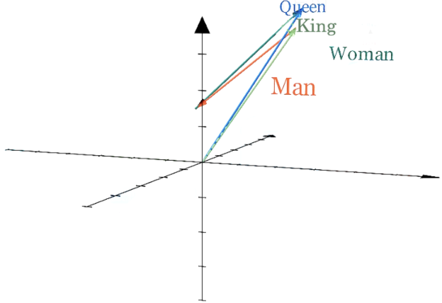
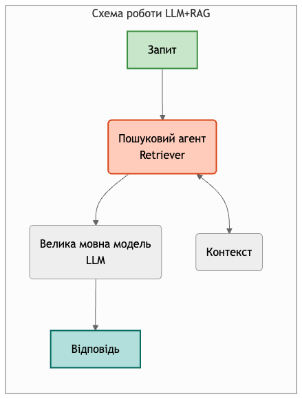
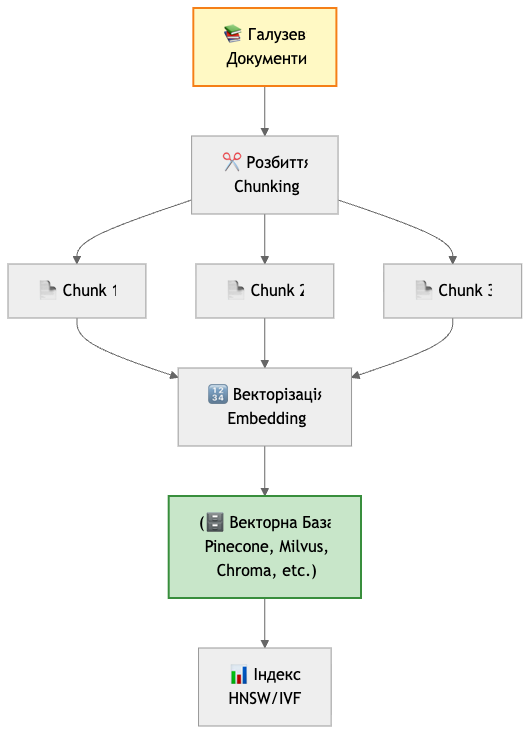
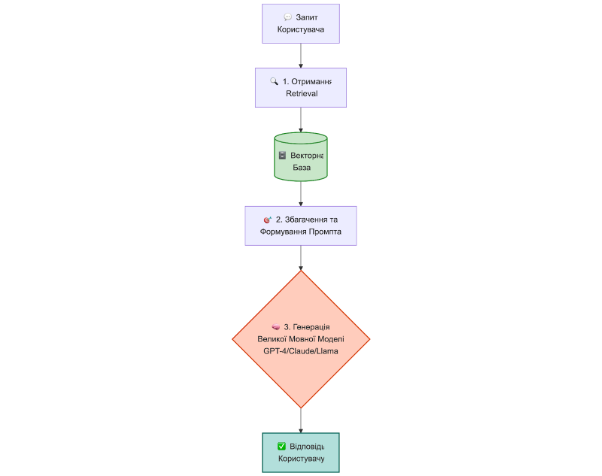



МІНІСТЕРСТВО ОСВІТИ І НАУКИ УКРАЇНИ

ДЕРЖАВНИЙ ВИЩИЙ НАВЧАЛЬНИЙ ЗАКЛАД 

«УЖГОРОДСЬКИЙ НАЦІОНАЛЬНИЙ УНІВЕРСИТЕТ»

ФАКУЛЬТЕТ МАТЕМАТИКИ ТА ЦИФРОВИХ ТЕХНОЛОГІЙ

КАФЕДРА CИСТЕМНОГО АНАЛІЗУ І ТЕОРІЇ ОПТИМІЗАЦІЇ

**ЧУБИРКА ВІКТОР ВАСИЛЬОВИЧ**

**ДОСЛІДЖЕННЯ ТА РОЗРОБКА СИСТЕМИ НА ОСНОВІ RETRIEVAL-AUGMENTED GENERATION (RAG) ДЛЯ СТВОРЕННЯ ГАЛУЗЕВОГО ПОМІЧНИКА НА БАЗІ ВЕЛИКОЇ МОВНОЇ МОДЕЛІ.**

124  - Системний аналіз

Дипломна робота на здобуття освітнього ступеня магістра

Науковий керівник:

**Глебена Мирослава Іванівна**

кандидат фізико-математичних наук, доцент

Ужгород – 2025

**Зміст**

[**Вступ	4**](#_207z72de24zq)

[**РОЗДІЛ 1. ТЕОРЕТИЧНІ ОСНОВИ ТЕХНОЛОГІЇ LLM	7**](#_56g23f799pgn)

[1.1. Архітектура та принципи роботи сучасних LLM	7](#_li9sayq6j2z2)

[1.2 Сучасні представники великих мовних моделей	9](#_ck0xx9omn5yg)

[1.3. Переваги та обмеження сучасних LLM	10](#_rgis7s6bmocn)

[1.3.1. Переваги базових великих мовних моделей	10](#_2d0jlu4totq)

[1.3.2. Обмеження базових великих мовних моделей	11](#_gr2w7p5jk9kx)

[1.4. Порівняльний аналіз методів адаптації LLM для галузевого помічника.	14](#_23ibphkwxg4a)

[1.5. Обґрунтування вибору RAG-підходу для галузевого помічника	15](#_ka8tf1mdsvox)

[1.6. Концепція та архітектура системи Retrieval-Augmented Generation (RAG)	17](#_pvdid03stm8w)

[**РОЗДІЛ 2. МЕТОДОЛОГІЯ ОПТИМІЗАЦІЇ RAG-СИСТЕМ	24**](#_6cxnmrj5hms)

[2.1. Стратегії оптимізації фази обробки запиту (Query Processing).	24](#_33hvcls509le)

[1. Виявлення намірів (Intent Detection)	24](#_ddydo3c87vaz)

[2. Переписування Запиту (Query Rewriting)	26](#_pq000sktcfqz)

[3. Розширення Запиту (Query Expansion)	28](#_57wk5h2zkij9)

[4. Розбиття Запиту (Query Decomposition)	29](#_msm0xax40mpm)

[2.2. Методи покращення точності пошуку (Retrieval Optimization).	30](#_x3wkxwxil2ip)

[1. Фільтрація за Метаданими (Metadata Filtering)	31](#_6m7gd56yyzm3)

[2. Гібридний Пошук (Hybrid Search)	33](#_yi0e78xlkcut)

[3. Переранжування (Re-ranking)	35](#_hwnw7wk4djeh)

[4. Збагачення та Компресія Контексту (Context Enrichment & Condensing)	38](#_1nvagefe80h1)

[2.3. Методи оптимізації генерації відповідей (Generation Optimization).	39](#_68yr1jr3n5m0)

[1. Інженерія](#_nqe143anka31)[c](#_nqe143anka31)[истемного ](#_nqe143anka31)[п](#_nqe143anka31)[ромпту ](#_nqe143anka31)[(System Prompt Engineering)	40](#_nqe143anka31)

[2. Додавання Цитувань (Citation Addition)	43](#_6x1qn4wf9xm5)

[2.4 Виявлення Галюцинацій та Оцінка Довіри (Hallucination Detection & Confidence Scoring):	45](#_fab7v8fqne5p)

[2.5. Еволюція архітектури: від простого RAG до Агентських систем (Agentic Loop).	45](#_wvfqmgwb3o25)

[● Поняття агентського підходу в RAG.	45](#_crziatyytsz2)

[● Автономна робота з інструментами (Function Calling).	45](#_ozg1x6rwj2mu)

[**РОЗДІЛ 3. ПРОЄКТУВАННЯ ТА ПРОГРАМНА РЕАЛІЗАЦІЯ СИСТЕМИ	46**](#_56g23f799pgn)

[3.1. Загальна архітектура системи та діаграма потоків даних (Data Flow).	46](#_2qahs2mt1zu)

[3.2. Підсистема обробки запитів (Query Processing):	46](#_8z9gtjrqwpcx)

[● Реалізація класифікації намірів користувача (Intent Detection).	46](#_56g23f799pgn)

[● Методи покращення запитів: Query Expansion та Query Decomposition.	46](#_56g23f799pgn)

[3.3. Інженерія даних та векторизація:	46](#_mp7515nms41y)

[● Стратегії сегментації тексту (Semantic Chunking).	46](#_56g23f799pgn)

[● Побудова та оновлення векторного індексу (Vector Store).	46](#_56g23f799pgn)

[3.4. Реалізація механізму пошуку та ранжування (Retrieval & Ranking):	46](#_s1hsujdon5k6)

[● Впровадження гібридного пошуку (Keyword + Semantic Search).	46](#_56g23f799pgn)

[● Застосування Cross-Encoder моделей для переранжування (Re-ranking) результатів.	46](#_56g23f799pgn)

[3.5. Модуль генерації відповіді (Generation):	46](#_fdblun36i538)

[● Інженерія системного промпту та Context Injection.	46](#_56g23f799pgn)

[● Механізми додавання цитувань та перевірка на галюцинації.	46](#_7z8vhhavzxng)

[3.6. Розробка клієнтського інтерфейсу та API.	47](#_r7pi99yyp84w)

[**РОЗДІЛ 4. ЕКСПЕРИМЕНТАЛЬНЕ ДОСЛІДЖЕННЯ ТА АНАЛІЗ РЕЗУЛЬТАТІВ	47**](#_c23jwe5fmhjv)

[4.1. Методика тестування та опис тестового набору даних (Dataset).	47](#_rj62ltcxol3)

[4.2. Оцінка якості пошуку (Retrieval Quality) розробленого прототипу.	47](#_vbz05nikvm6g)

[4.3. Оцінка релевантності та точності згенерованих відповідей (Generation Quality).	47](#_sy766y59luz6)

[4.4. Аналіз роботи системи на прикладі галузевих сценаріїв (Use Cases).	47](#_ey6bzk1ehan9)

[**ВИСНОВКИ СПИСОК ВИКОРИСТАНИХ	48**](#_ssdoejwtessk)

[**ДОДАТКИ	49**](#_w44ogxb33bvs)
# **
# **Вступ**
**Актуальність теми**

Стрімкий розвиток великих мовних моделей (LLM) сприяв поширенню інтелектуальних систем, здатних генерувати зв’язний текст, здійснювати аналіз даних і підтримувати широке коло професійних задач. Проте, попри високу універсальність, стандартні LLM мають низку суттєвих обмежень, що ускладнює їхнє використання у вузькоспеціалізованих сферах. Зокрема, моделі демонструють схильність до галюцинацій - генерації недостовірної інформації, а також характеризуються застарілістю знань, оскільки їхня тренувальна вибірка не оновлюється у режимі реального часу. Це створює критичну проблему для застосування LLM у галузевих помічниках, що потребують високої точності відповідей, актуальності даних та роботи з специфічною термінологією.

Одним із найбільш ефективних підходів до подолання цих обмежень є Retrieval-Augmented Generation (RAG) - технологія, що поєднує мовні моделі з зовнішніми джерелами знань. RAG забезпечує можливість точного витягання релевантної інформації без необхідності повторного тренування моделі, що значно підвищує якість відповідей у спеціалізованих областях. Це зумовлює зростання наукового та практичного інтересу до розробки галузевих помічників на основі RAG.

Таким чином, **проблемою**, що вирішується у даній дипломній роботі, є розроблення ефективної архітектури RAG-системи, здатної підвищувати точність отримуваної інформації, а також забезпечити можливість прозорого цитування використаних матеріалів. Це, у свою чергу, дає змогу користувачеві не лише отримувати релевантні дані, але й перевіряти їхнє походження, що підвищує довіру до результатів роботи системи.

**Метою роботи** є дослідження підходів Retrieval-Augmented Generation та розробка програмного прототипу галузевого помічника на основі LLM з інтеграцією зовнішніх джерел знань.

Для досягнення поставленої мети передбачено виконання таких **завдань**:

1. Проаналізувати архітектурні особливості сучасних LLM в якості галузевого помічника
1. Дослідити обмеження LLM та обґрунтувати переваги застосування RAG-систем.
1. Розробити концептуальну та технічну архітектуру галузевого помічника на основі RAG.
1. Реалізувати програмний прототип системи з використанням механізмів індексації, пошуку та генерації відповідей.
1. Провести експериментальну оцінку точності, релевантності та продуктивності запропонованої системи.
1. Узагальнити результати та сформулювати висновки.

**Об’єкт дослідження:** процеси отримання, опрацювання та генерації інформації з використанням сучасних великих мовних моделей.

**Предмет дослідження:** методи застосування підходу RAG для створення галузевого помічника з підвищеною точністю відповідей та можливістю посилання на джерела.

Для досягнення мети роботи використано наступні методи дослідження:

1. Метод 1
1. Методі 2
1. Метод 3
1. Метод 4
1. Метод 5

# **
# **РОЗДІЛ 1. ТЕОРЕТИЧНІ ОСНОВИ ТЕХНОЛОГІЇ  LLM** 
## **1.1. Архітектура та принципи роботи сучасних LLM**
Упродовж останнього десятиліття розвиток технологій штучного інтелекту зробив значний крок уперед завдяки появі великих мовних моделей (Large Language Models, LLM). Ці системи здатні обробляти, аналізувати та генерувати природну мову з рівнем якості, який наближається до людського. Сучасні LLM являють собою клас нейронних мереж, навчений на масштабних масивах текстових даних для вирішення широкого спектра завдань обробки природної мови (NLP).

Фундаментом їхнього успіху стала **архітектура Transformer**, запропонована у 2017 році дослідниками Google у праці *“Attention Is All You Need”*. Саме ця архітектура забезпечила революційний прорив у сфері NLP, оскільки дала змогу ефективно навчати моделі на величезних корпусах тексту та враховувати складні довгострокові залежності між словами. Завдяки цьому трансформери стали основою більшості сучасних високопродуктивних мовних моделей і відкрили шлях до якісно нових можливостей у генерації та розумінні природної мови.

Перед тим як потрапити до моделі, текст проходить етап **токенізації** - розбиття на мінімальні одиниці інформації, **токени** (це можуть бути окремі слова, частини слів або навіть символи). 

Кожен токен перетворюється у **векторне представлення (embedding)** - набір числових значень, які описують його значення у багатовимірному просторі. У цьому просторі близькі за змістом слова розташовані поруч, що дозволяє моделі розпізнавати семантичні зв’язки та контекст.

**Рис 1.** Представлення слів у векторному просторі

Таким чином, **embedding** є математичним відображенням значення слова, а сукупність таких векторів формує основу, на якій модель "розуміє" текст. Ці представлення передаються далі в архітектуру трансформера, де починає діяти система уваги.

Ключовим елементом, що забезпечує ефективність трансформерів, є **механізм самоуваги (Self-Attention)**. Його основна ідея полягає в тому, що під час обробки тексту **модель оцінює, які слова у реченні найважливіші для розуміння поточного слова**. Таким чином, кожне слово аналізується не окремо, а з урахуванням усього контексту речення. Завдяки цьому механізму трансформери можуть **розуміти як граматичні, так і смислові зв’язки** між словами, навіть якщо вони розташовані далеко одне від одного. Це дозволяє моделі точніше розуміти зміст тексту й будувати зв’язні відповіді.

Таким чином, великі мовні моделі є ключовим етапом еволюції штучного інтелекту. Вони поєднують здатність до узагальнення, розуміння контексту й генерації природної мови, що робить їх універсальним інструментом для побудови інтелектуальних систем нового покоління.
## **1.2 Сучасні представники великих мовних моделей**
На сьогодні існує велика кількість LLM, створених як академічними установами, так і провідними технологічними компаніями. Серед найбільш відомих та впливових можна виокремити такі:

- **GPT (Generative Pre-trained Transformer)** - серія моделей від компанії OpenAI, зокрема GPT-3.5, GPT-4 та GPT-5.1, які стали основою систем ChatGPT. Моделі цієї лінійки демонструють високу здатність до узагальнення, контекстної генерації текстів, програмного коду та ведення діалогів.\
  **BERT (Bidirectional Encoder Representations from Transformers)** від *Google* - орієнтована на розуміння контексту тексту, а не його генерацію. BERT - стала   базою для численних моделей, що виконують завдання класифікації, аналізу настроїв, пошуку тощо.
- **LLaMA (Large Language Model Meta AI)** - відкрита модель компанії Meta, спрямована на дослідження та підвищення ефективності навчання за умов обмежених ресурсів. Вона стала основою багатьох інноваційних відкритих проєктів.
- **Claude** (від компанії Anthropic) - модель, що робить акцент на безпеці, надійності, пояснюваності та мінімізації ризику небажаних або шкідливих відповідей.
- **Gemini** (раніше Bard) від Google DeepMind - багатомодальна модель, яка поєднує роботу з текстом, зображеннями та відео й тісно інтегрується з пошуковими технологіями Google.
## **1.3. Переваги та обмеження сучасних LLM**
Великі мовні моделі (Large Language Models, LLM) стали важливим інструментом у сучасних інформаційних технологіях. Вони демонструють високий рівень універсальності, здатність до адаптації та широке застосування у різних галузях. Проте, попри значні досягнення, LLM мають низку обмежень, які ускладнюють їх використання для спеціалізованих або критично важливих задач. У цьому підрозділі розглянемо основні переваги, сфери використання та недоліки базових моделей.
### **1.3.1. Переваги базових великих мовних моделей**
**Універсальність і гнучкість застосування**. Головною перевагою сучасних LLM є їх здатність розв’язувати широкий спектр завдань без необхідності створення окремих моделей під кожну задачу. Основні сфери застосування включають:

- **Генерація контенту:** написання текстів різних жанрів, маркетингових матеріалів, есе та звітів.
- **Інтелектуальні чат-боти:** підтримка природного діалогу з користувачем (Customer Support).
- **Узагальнення (Summarization):** автоматичне створення резюме довгих документів, новин або протоколів зустрічей.
- **Машинний переклад:** високоякісний переклад між десятками мов з урахуванням контексту.
- **Написання коду:** допомога розробникам у генерації, поясненні та налагодженні програмного коду (наприклад, Python, SQL).

**Здатність до контекстного розуміння.** Моделі здатні аналізувати вхідний текст, враховуючи нюанси мови, тональність та зв’язки між словами, що дозволяє їм давати більш релевантні відповіді, ніж традиційні алгоритми пошуку за ключовими словами.

**Легкість у використанні.** Взаємодія з LLM відбувається звичайною (природною) мовою. Крім того, наявність доступних API дозволяє швидко інтегрувати можливості штучного інтелекту в різноманітні веб-сервіси та мобільні застосунки без необхідності розгортання власної складної інфраструктури для навчання моделей.

**Zero-shot та few-shot навчання.** Моделі можуть виконувати нові завдання, маючи лише коротку інструкцію або кілька прикладів. Наприклад, при правильному формулюванні запиту (prompt) LLM може класифікувати текст або витягувати з нього дані, навіть якщо вона не була спеціально навчена саме для цього типу документів.

**Підтримка багатомовності.** Завдяки навчанню на багатомовних корпусах текстів, LLM можуть працювати з десятками мов, зокрема українською, англійською, німецькою тощо, що робить їх універсальними інструментами для глобальної комунікації та локалізації продуктів.
### **1.3.2. Обмеження базових великих мовних моделей**
Попри значні досягнення, базові великі мовні моделі мають низку суттєвих недоліків, які впливають на їхню ефективність і достовірність у практичному використанні, особливо в корпоративному секторі.

**Відсутність актуальності знань (Knowledge Cutoff).** Одним з найсуттєвіших обмежень базових LLM є те, що їхні знання обмежені датою останнього навчання моделі.  Моделі не мають доступу до інформації про події, факти, дослідження чи зміни, які відбулися після цієї дати.  Для динамічних галузей, де інформація швидко застаріває (медицина, законодавство, технології), це створює серйозні проблеми:

- неможливість надати інформацію про актуальні події;
- відсутність даних про нові дослідження та публікації;
- незнання змін у нормативно-правових актах.
- застаріла інформація про статистику, ціни, показники.

**Проблема галюцинацій (Hallucinations).** Модель може генерувати фактично хибні або вигадані твердження, які виглядають правдоподібно. Це зумовлено природою роботи LLM - вони не «знають» фактів, а лише прогнозують найбільш вірогідне наступне слово.

**Відсутність доступу до приватних даних.** Базові моделі навчаються на публічно доступних даних з Інтернету, тому вони не завжди можуть знати специфічну термінологію або контекст певної професійної сфери. Використання публічних моделей для роботи з такими даними без додаткових налаштувань є неможливим.

**Обмеження контекстного вікна.** Кожна модель має обмеження на кількість токенів, які вона може враховувати одночасно.  Це ускладнює роботу з великими документами. До того ж, існує ефект "lost in the middle", коли модель гірше сприймає інформацію з середини довгого тексту. Це створює труднощі під час роботи з великими документами або довгими діалогами. 

**Відсутність верифікації фактів.** LLM не мають вбудованого механізму перевірки істинності згенерованої інформації. Без інтеграції із зовнішніми джерелами (наприклад, через технологію RAG) вони не можуть гарантувати достовірність відповіді та надати посилання на першоджерело.

**Етичні та безпекові ризики.** Через масштаб навчальних даних моделі можуть відтворювати упередження, дискримінаційні вислови або небажаний контент. Тому для їхнього практичного використання важливими є механізми фільтрації, модерації та відповідального застосування.

Тому для ефективного використання LLM у специфічних галузях стандартних можливостей самої моделі часто недостатньо через проблему галюцинацій та застарілість знань. Це обумовлює необхідність інтеграції LLM із зовнішніми джерелами даних, про що йтиметься далі.
## **1.4. Порівняльний аналіз методів адаптації LLM для галузевого помічника.** 
Далі буде, або
## **
## **1.5. Обґрунтування вибору RAG-підходу для галузевого помічника**
Попри значні досягнення у сфері великих мовних моделей, їхнє ефективне використання у прикладних галузях залишається обмеженим через низку технічних і концептуальних проблем. Насамперед ідеться про обмежену актуальність знань, ризик галюцинацій та нездатність самостійно перевіряти достовірність інформації. У практичних сценаріях - наприклад, у медицині чи праві - такі недоліки можуть призвести до неправильних висновків або помилкових рекомендацій, що є неприйнятним для критично важливих систем.

Тому сучасні дослідження спрямовані на створення **механізмів доповнення мовних моделей зовнішніми джерелами знань**. Ідея полягає в тому, щоб поєднати сильні сторони LLM - здатність аналізувати контекст і генерувати природні відповіді - із перевіреною, структурованою інформацією з баз даних, документів або пошукових систем. Такий підхід дозволяє не лише підвищити точність відповідей, а й забезпечити їх **фактичну достовірність та актуальність**.

Одним із найефективніших рішень у цьому напрямі є технологія **Retrieval-Augmented Generation (RAG)**, яка поєднує механізм генерації тексту з попереднім етапом пошуку релевантних даних. У системах цього типу модель спочатку здійснює **семантичний пошук** інформації у зовнішніх джерелах, а потім формує відповідь на основі знайденого контексту. Завдяки цьому користувач отримує змістовну, перевірену та контекстно точну відповідь, що значно підвищує практичну цінність таких систем.

Таким чином, розвиток і вдосконалення підходів на основі RAG є **ключовим напрямом подолання обмежень базових LLM**. Поєднання генеративних можливостей мовних моделей із механізмами пошуку знань відкриває шлях до створення **інтелектуальних галузевих помічників**, які здатні не лише генерувати текст, але й надавати достовірну, обґрунтовану та актуальну інформацію.
## **1.6. Концепція та архітектура системи Retrieval-Augmented Generation (RAG)**
Архітектура Retrieval-Augmented Generation (RAG) є інноваційним підходом, що поєднує можливості Великих Мовних Моделей (LLM) з механізмами отримання інформації (Retrieval). Цей гібридний метод розроблений для подолання ключових обмежень стандартних LLM, які полягають у їхній схильності до "галюцинацій" (генерації неправдивої або вигаданої інформації) та обмеженій актуальності їхніх знань, зафіксованих на момент тренування.

Основна ідея RAG полягає в тому, що перед генерацією відповіді LLM спочатку звертається до зовнішнього, авторитетного та актуального джерела знань (наприклад, до бази даних документів, статей або галузевої документації), щоб отримати релевантні контекстуальні фрагменти (chunks, snippets). Ці фрагменти потім використовуються як додатковий вхідний контекст для LLM, що значно підвищує точність, надійність та обґрунтованість згенерованої відповіді.

**Рис 2.** Пайплайн RAG

### **
**Основні компоненти та етап індексації (Indexing Phase)**

Типова архітектура RAG складається з двох ключових компонентів: 

**Бази знань (Knowledge Base)** та **Конвеєра RAG**. 

Першим етапом є підготовка даних, або індексація цей етап є критично важливим для ефективності RAG системи.

1. **Джерело даних:** збір та обробка галузевих документів, що становлять зовнішню базу знань.  Це можуть бути нормативні акти, технічні специфікації, внутрішні звіти, навчальні матеріали тощо.
1. **Розбиття (Chunking):** документи поділяються на менші фрагменти (чанки). Оптимальний розмір чанка має бути достатнім для збереження сенсу, але й достатньо малим для ефективного пошуку.
1. **Векторизація (Embedding):** кожен текстовий фрагмент (чанк) перетворюється на **векторне представлення (embedding)** за допомогою моделі ембедінгів. Цей процес перетворює текст на багатовимірний числовий вектор, де семантично схожі фрагменти мають близькі вектори в просторі.
1. **Векторна База Даних (Vector Database):** згенеровані вектори та відповідні їм текстові фрагменти зберігаються у спеціалізованій **векторній базі даних**(наприклад, Pinecone, Chroma, FAISS). Це дозволяє проводити швидкий пошук за **семантичною схожістю**.

**Конвеєр RAG** виконується в режимі реального часу та складається з трьох послідовних кроків: пошуку, збагачення контексту та генерації відповіді.

**Крок 1: пошук релевантної інформації (Retrieval)** На цьому етапі запит користувача трансформується у векторне представлення (embedding) за допомогою тієї ж моделі, що використовувалася для індексації бази знань. Далі система виконує пошук у векторній базі даних, застосовуючи алгоритми пошуку найближчих сусідів (наприклад, Approximate Nearest Neighbors - ANN) або обчислення косинусної схожості. Результатом цього кроку є вибірка з **K** текстових фрагментів (chunks), які мають найвищий показник семантичної близькості до запиту користувача.

**Крок 2:  збагачення (Augmentation)**  Отримані релевантні фрагменти інтегруються з початковим питанням користувача та системною інструкцією (System Prompt). Системна інструкція визначає роль моделі (наприклад, "галузевий експерт"), стиль спілкування та обмеження. Таким чином формується єдиний розширений промпт, структура якого схематично виглядає так:

**Розширений запит = Системна інструкція + Отриманий контекст: Знайдені фрагменти + Запит користувача** 

Така структура, нам гарантує, що відповідь моделі буде базуючись виключно на наданому контексті.

**Крок 3: генерація (Generation)** сформований розширений промпт передається на вхід великій мовній моделі (LLM). Модель генерує відповідь, спираючись виключно на наданий контекст. Цей підхід мінімізує ризик галюцинацій, оскільки генерація жорстко прив'язана до достовірних джерел, знайдених на першому етапі. Після чого користувач отримує остаточну, обґрунтовану та контекстуально релевантну відповідь.

Ключова перевага архітектури RAG полягає в її здатності забезпечувати **доказовість (grounding)** відповідей, що є критичним для створення **галузевого помічника**.

- **Актуальність:** система RAG може використовувати новітні дані, не вимагаючи перенавчання всієї LLM (що є ресурсомістким). Достатньо оновити лише векторну базу даних.
- **Прозорість (Explainability):** на відміну від "чорного ящика" традиційної LLM, RAG дозволяє прив'язати згенеровану відповідь до конкретних вихідних документів, підвищуючи довіру користувачів.
- **Контроль:** обмежуючи контекст галузевими даними, RAG дозволяє точно контролювати інформаційне поле, в якому працює LLM, що є життєво важливим для дотримання стандартів і політик у спеціалізованих сферах.

У контексті даної дипломної роботи, архітектура RAG є оптимальною для створення галузевого помічника, оскільки вона дозволяє ефективно інтегрувати вузькоспеціалізовані знання у потужний генеративний фреймворк.
#
# **
# **РОЗДІЛ 2. МЕТОДОЛОГІЯ ОПТИМІЗАЦІЇ RAG-СИСТЕМ**
`     `Хоча реалізована базова архітектура RAG забезпечує значний приріст якості порівняно з базовою Великою Мовною Моделлю (LLM), для створення комерційно надійного та високоточного галузевого помічника необхідно впроваджувати передові методи оптимізації. Ці вдосконалення спрямовані на підвищення якості на кожному етапі RAG-конвеєра: від інтерпретації запиту до фінальної генерації відповіді.
## **2.1. Стратегії оптимізації фази обробки запиту (Query Processing).**
`      `Основна мета – перетворити нечіткий запит користувача на високоточний пошуковий вектор. Для цього застосовуються наступні методи:
### **1. Виявлення намірів (Intent Detection)**
`       `Замість того, щоб сприймати кожен запит як однаковий пошуковий рядок, система класифікує його за категоріями, що відображають **тип інформації**, яку насправді шукає користувач.

`      `Це ключовий етап **семантичного перетворення запиту**, що забезпечує адаптивність системи.

- **Суть:** використання класифікаційної моделі (LLM) для **автоматичного визначення мети** запиту користувача (Намір).
  - **Приклади Намірів:** "пошук юридичного прецеденту", "порівняння технічних характеристик", "просте питання-відповідь", "узагальнення документа".
- **Методологія:** запит класифікується за попередньо визначеними категоріями, що дозволяє отримати **відповідний контекст** до початку пошуку.
- **Ключова перевага:** дозволяє системі **динамічно обирати оптимальну стратегію** пошуку (Retrieval) та генерації (Generation). Це запобігає використанню єдиного, неоптимального підходу для всіх типів запитів, значно підвищуючи якість результату.

|**Приклад запиту**|**Визначений намір**|**Стратегія системи**|
| :- | :- | :- |
|**"Порівняйте Python та Java для машинного навчання"**|**Порівняння об'єктів** (Comparison)|Зіставити характеристики, виділивши плюси та мінуси кожного.|
|**"Скільки кілограмів у тонні?"**|**Простий пошук факту**|Знайти та повернути один точний числовий факт.|
|**"Підсумуй статтю про нові правила дорожнього руху."**|**Узагальнення тексту** (Summarization)|Стисло виділити **ключові зміни** в тексті статті.|
|**"Навіщо потрібен вітамін D?"**|**Пошук пояснення/призначення**|Знайти та описати основну функцію.|

### **2. Переписування запиту (Query Rewriting)**
`   `Це техніка, за якої Велика Мовна Модель (LLM) переформульовує початковий запит користувача на **чіткішу, повнішу та більш структуровану форму** без зміни його основного семантичного сенсу.

`    `Цей підхід є необхідним для обробки **нечітких** запитів, які виникають у ході діалогу. Користувачі часто використовують короткі фрази або займенники ("А які його недоліки?"), що є недостатньою інформацією для ефективного пошуку. LLM аналізує історію діалогу та контекст, щоб створити **самостійний, повний пошуковий рядок**, який максимально відповідає формату документації, що зберігається в базі знань.

|**Оригінальний запит (користувач)**|**Переписаний запит (Query Rewriting)**|
| :- | :- |
|"Як це працює?" (Після обговорення "Модуля X")|"Поясни роботу Модуля X у Системі Y, згідно з технічною документацією."|
|"Документи про налаштування VPN"|"Інструкції щодо налаштування корпоративного VPN, включно з конфігурацією клієнта та серверної частини."|

### **3. Розширення запиту (Query Expansion)**
Розширення запиту полягає у генерації та додаванні **синонімів, пов'язаних термінів, альтернативних формулювань** або додаткових ключових слів до початкового (або вже переписаного) запиту.

`   `Основна мета полягає у підвищенні **повноти пошуку**. База знань може використовувати різну термінологію для опису одного й того ж поняття ("забув пароль", "проблеми з логіном", "відновлення доступу). Генеруючи 3–5 семантично схожих фраз, завдяки чому RAG-система охоплює ширший спектр термінології та значно збільшує шанси знайти релевантні фрагменти, навіть якщо оригінальний запит користувача не збігається з точними формулюваннями в документах. 

|**Оригінальний запит**|**Розширені варіанти (використовуються для пошуку)**|
| :- | :- |
|**"Не працює світло"**|"зникла електрика", "вибило пробки", "відсутня напруга", "відключення електроенергії"|
|"Збій принтера"|"помилка друку", "принтер не друкує", "проблема з картриджем", "немає зв'язку з друкувальним пристроєм"|

### **4. Розбиття запиту (Query Decomposition)** 
`    `Цей підхід потрібен, коли користувач ставить дуже складне запитання, яке містить кілька окремих ідей. Замість того, щоб намагатися знайти одну загальну відповідь, LLM виступає в ролі аналітика, яка **автоматично розділяє** оригінальний запит на серію **простих, самостійних підзапитів**. Після того, як запит розділено, система виконує незалежний пошук для кожного підзапиту. Це призводить до збору кількох, але дуже релевантних фрагментів з різних документів. На завершення, LLM об'єднує ці зібрані фрагменти в єдиний контекст і використовує їх для **формування однієї, інтегрованої та вичерпної відповіді** користувачу, що значно підвищує якість генерації.

|**Складний запит (Користувач)**|**Розбиття на підзапити (Query Decomposition)**|
| :- | :- |
|"Які **вимоги до пам'яті** для цього ПЗ і чи підтримує воно **Linux**?"|1\. Які вимоги до оперативної пам'яті для цього програмного забезпечення (ПЗ)? 2. Чи підтримує ПЗ операційну систему Linux?|
|"Як подати заявку на **технічну підтримку** та які **документи** для цього потрібні?"|
1\. Інструкція: як подати заявку на технічну підтримку.

` `2. Перелік документів, необхідних для подачі заявки.
|

## **2.2. Методи покращення точності пошуку (Retrieval Optimization).**
**Основна мета** – максимізувати релевантність знайдених даних, гарантуючи, що система знайде не просто документи "схожі за темою", а саме ті фрагменти, які містять точні факти, цифри або специфікації, які необхідні для більш точної відповіді.

Для цього використовуються наступні методи:
### **1. Фільтрація за метаданими (Metadata Filtering)**
`    `Часто запит користувача містить не лише тематику, а й чіткі обмеження, які складно зрозуміти лише через векторний аналіз тексту (наприклад, часові рамки, статус документа або ім'я автора). Векторний пошук "бачить", що документи за 2015 та 2024 роки семантично схожі, і може помилково видати застарілу інформацію.

**Суть:** Використання структурованих атрибутів (метаданих), прикріплених до кожного документа в базі знань (дата створення, тип файлу, відділ, рівень доступу), для звуження простору пошуку ще до (або під час) виконання основного запиту.

**Як це працює:**

1. Система аналізує запит і виокремлює окремі фільтри (наприклад, із фрази "звіти за минулий місяць" витягується фільтр date > 01.10.2024).
1. Пошук виконується виключно серед документів, що відповідають цьому критерію.

Це допомагає суттєво підвищити точність знайдених документів. Система гарантовано ігнорує не актуальні дані або документи, до яких у користувача немає доступу, навіть якщо вони дуже схожі за змістом на запит.

|**Запит користувача**|**Результат   без фільтрації**|**Результат з фільтрацією за метаданими**|**Пояснення**|
| :- | :- | :- | :- |
|**"Накази по відпустках за 2024 рік"**|Система може видати накази за 2020–2023 роки, бо текст у них майже ідентичний (шаблонний), а векторна схожість висока.|Тільки накази, що мають атрибут year: 2024.|Фільтр жорстко відсік старі документи, попри їхню текстову схожість.|
|**"Інструкція з безпеки для менеджерів"**|Може видати інструкцію для "інженерів", бо слова "безпека" та "інструкція" там зустрічаються частіше.|Тільки документи з тегом role: manager.|Система обмежила пошук лише тими файлами, що стосуються конкретної посади.|

### **2. Гібридний пошук (Hybrid Search)**
`    `Гібридний пошук поєднує **переваги точного пошуку за ключовими словами** та **семантичного векторного пошуку**.\
`     `Векторні моделі чудово розуміють зміст і контекст, але можуть пропускати важливі специфічні терміни - абревіатури, назви обладнання, номери документів. Натомість BM25 гарантує знаходження саме таких точних збігів.

Тому система використовує **два підходи одночасно**:

- **BM25 (keyword search)** - Шукає точні співпадіння (як класичний Ctrl+F). Він критично важливий для пошуку специфічних назв, номерів наказів, марок обладнання.
- **Векторний пошук** - розпізнає сенс і знаходить релевантну інформацію навіть тоді, коли в тексті використані інші формулювання чи синоніми (наприклад, запит "поломка двигуна" знайде документ про "дефект мотора").

`     `Суть методу полягає в тому, що обидва алгоритми запускаються паралельно для одного запиту, а їхні результати потім **інтелектуально об’єднуються**. Завдяки чому користувач отримує максимально повну й точну відповідь.

**Ключова перевага:** гібридний підхід компенсує недоліки кожного методу окремо. Система знаходить документи, які концептуально відповідають запиту, але водночас не пропускає матеріали з критично важливими точними термінами (наприклад, код помилки *“E-404”* або назву стандарту *“ISO 27001”*).

|**Запит користувача**|**Що знайде векторний пошук**|**Що знайде ключовий пошук (BM25)**|**Результат гібридного підходу**|
| :- | :- | :- | :- |
|*"Інструкція до насоса XJ-500"*|Статті про насоси та гідравліку (зрозумів тему), але може запропонувати модель XJ-600, бо вони схожі.|Документи, де точно є текст "XJ-500", навіть якщо це просто рядок у прайсі.|Інструкція саме до моделі XJ-500 (поєднав розуміння, що це інструкція, з точним номером).|
|*"Чому деталь іржавіє?"*|Статті про "корозію металів" (зрозумів синонім іржавіє -> корозія).|Може нічого не знайти, якщо в базі використовується тільки науковий термін "корозія".|**Ідеально:** Стаття про корозію (вектор допоміг знайти сенс, там де ключові слова не впоралися).|

### **3. Переранжування (Re-ranking)**

Після гібридного пошуку система отримує досить широкий список кандидатів - наприклад, кілька десятків фрагментів тексту, які формально виглядають релевантними, але не завжди є справді корисними. На цьому етапі в роботу включається **переранжування** - інтелектуальний фільтр другого рівня, який працює подібно до того, як людина уважно перечитує знайдений текст.

**Суть методу:** спеціалізована модель **Cross-Encoder** детально аналізує взаємозв’язок між запитом і кожним знайденим документом. Вона оцінює не просто схожість слів, а логічну відповідність тексту поставленому питанню

**Як це працює:**

1. **Попередній відбір:** гібридний пошук швидко формує список кандидатів - наприклад, топ-50.
1. **Глибоке оцінювання:** переранжувальник уважно аналізує ці фрагменти, присвоює їм точнішу оцінку релевантності та залишає лише найбільш змістовні.

У підсумку до LLM передаються **5–10 найкращих уривків**, що забезпечує чітку, точну й логічно узгоджену відповідь

|**Запит користувача**|**Позиція після звичайного пошуку (до Re-ranking)**|**Позиція після переранжування (після Re-ranking)**|**Чому змінився порядок?**|
| :- | :- | :- | :- |
|**"Які штрафи передбачені за порушення термінів подачі звіту?"**|**1-ше місце:** Документ про *правила* подачі звіту (без згадки сум штрафів).|**Відсіяно (не в топі)**|Пошук підняв документ через часте повторення слів "звіт" та "подача", але Re-ranker побачив, що там немає відповіді на питання "які штрафи".|
||**2-ге місце:** Стаття "Історія змін у звітності за 2020 рік".|**Відсіяно**|Застаріла інформація, хоча слова дуже схожі.|
||**35-те місце:** Таблиця "Адміністративна відповідальність та санкції".|**1-ше місце (Топ-1)**|Первинний пошук занизив цей документ, бо там не було слова "звіт" (а було "документація"), але Re-ranker зрозумів, що "санкції" - це і є відповідь на "штрафи".|

У цьому прикладі гібридний пошук знайшов три документи, але їх первинне сортування було неточним. Re-ranker виправив порядок видачі та відсіяв не релевантні документи.
### **4. Збагачення та Компресія Контексту (Context Enrichment & Condensing)**
`   `Навіть після переранжування знайдені фрагменти можуть містити багато "шуму" (зайвої води, вступних слів) або бути вирваними з контексту, що ускладнює роботу LLM. Крім того, надмірна кількість тексту може призвести до ефекту "Lost in the Middle", коли модель "забуває" інформацію, що знаходиться посередині довгого промпту.

Суть полягає в тому, щоб максимізувати щільність корисної інформації (Information Density), передаючи моделі лише суть, а не "сирий" текст.

**Методи реалізації:**

- **Компресія (Condensing):** Використання меншої, швидшої моделі для "вижимки" знайдених документів. Вона видаляє неважливі речення, стоп-слова та надлишковість, залишаючи лише ключові факти. Це дозволяє вмістити більше джерел у контекстне вікно без втрати якості.
- **Контекстне збагачення (Enrichment):** іноді знайдений фрагмент є надто коротким (наприклад, рядок таблиці "100 грн."). Метод збагачення автоматично додає до цього фрагмента його "оточення" - заголовки стовпчиків таблиці або попереднє речення, щоб модель зрозуміла, чого саме стосується ця цифра.

LLM отримує не 10 сторінок "сирого" тексту, а 2 сторінки концентрованих фактів. Це знижує вартість запиту, пришвидшує генерацію та зменшує ймовірність галюцинацій, оскільки модель не відволікається на нерелевантний текст.

## **2.3. Методи оптимізації генерації відповідей (Generation Optimization).**
**Основна мета** – перетворити набір знайдених фрагментів тексту на зв’язну, професійну та точну відповідь, яка суворо відповідає заданому формату та базується виключно на фактах із бази знань.

Просто знайти інформацію недостатньо; необхідно змусити модель правильно її інтерпретувати та подати користувачеві. Для цього застосовуються наступні методи:
### **1. Інженерія Системного Промпту (System Prompt Engineering)**
Це набір жорстких інструкцій, які визначають поведінку моделі ще до того, як вона побачить питання користувача. Для галузевого помічника критично важливо обмежити "творчість" моделі та змусити її діяти як експерт.

**Суть:** Створення спеціального шаблону (System Prompt), який "огортає" знайдені документи та питання користувача. Цей шаблон диктує роль, тон, формат відповіді та правила безпеки.

**Структура промпту формується динамічно і складається з таких ключових блоків:**

1. **Роль (Role):** задає **експертну область** моделі, визначаючи її як галузевого фахівця (наприклад, інженера чи юриста) для забезпечення професійного тону відповіді.
1. **Інструкції (Instructions):** встановлюють **формат виводу** (таблиця, список, JSON) та вимоги до стилю, що є критичним для подальшої автоматизованої обробки відповіді системою.
1. **Знайдений Контекст (Retrieved Context):** це **динамічний масив даних**, отриманий на фазі Retrieval, який є єдиною достовірною базою фактів, дозволеною моделі для використання.
1. **Критичні Обмеження (Critical Constraints):** це **суворі заборони** (наприклад, "не галюцинувати"), розташовані після контексту для використання **ефекту новизни**, що підвищує безпеку та точність відповіді.
1. **Запитання (Question):** це **фінальний тригер** до генерації, який являє собою очищений та уточнений запит користувача, що спрямовує модель на виконання завдання.

|**Тип промпту**|**Вхідні дані для моделі**|**Результат генерації**|
| :- | :- | :- |
|**Базовий (Zero-shot)**|"Ось текст: [Текст]. Дай відповідь на питання: [Питання]."|Модель може додумати факти, відповісти занадто розмито або почати філософствувати.|
|**Оптимізований (Role-based + Constraints)**|
**Роль:** ` `Ти - старший інженер технічної підтримки.

**Інструкції:** ` `Пояснюй технічно точно й лаконічно, у стилі службової документації. ` `Не використовуй розмитих фраз. ` `Не роби припущень. ` `Відповідай чітко та по суті.

**Знайдений контекст:** ` `[Вставити знайдений фрагмент тексту з документації]

**Критичні обмеження:** ` `– Використовуй лише наданий контекст. ` `– Не додавай інформації ззовні. ` `– Якщо відповідь відсутня у контексті, повідом про це. ` `– Дотримуйся технічного стилю викладу.

**Запитання:** ` `[Вставити конкретне питання]
|Чітка інструкція, що містить технічні терміни, без зайвої "води", суворо за темою документа.|

### **2. Додавання Цитувань (Citation Addition)**
`   `Для професійного використання важливо не просто отримати відповідь, а знати, звідки вона взята. Це викликає довіру до системи та дозволяє швидко перевірити факти.

**Суть:** налаштування моделі таким чином, щоб кожне твердження у відповіді супроводжувалося посиланням на конкретний документ або сторінку, з якої була взята інформація.

**Як це працює:**

1. На етапі пошуку (Retrieval) разом із текстом зберігається метадані (ID документу, назва файлу).
1. В інструкції (Prompt) моделі надається вимога: "Вказуй джерело у форматі [назва файлу, стор. X] після кожного факту".

Додає прозорості, та довзволяє користувачу швидко верифікувати відповідь. Це критично для юридичних, фінансових або технічних запитів, де помилка коштує дорого.

|**Питання**|**Звичайна відповідь (без атрибуції)**|**Відповідь з атрибуцією (Professional RAG)**|
| :- | :- | :- |
|*"Який термін дії гарантії на компресор?"*|"Гарантія на компресор становить 24 місяці за умови правильної експлуатації."|"Гарантійний термін на компресорну установку становить **24 місяці** *[Джерело: Гарантійний\_талон\_2024.pdf, стор. 2]*. Проте, при використанні неоригінального мастила термін скорочується до **6 місяців** *[Джерело: Інструкція\_експлуатації.docx, розділ 4.1]*."|

## **2.4 Виявлення Галюцинацій та Оцінка Довіри (Hallucination Detection & Confidence Scoring):**
## **2.5. Еволюція архітектури: від простого RAG до Агентських систем (Agentic Loop).**
- ### **Поняття агентського підходу в RAG.**
- ### **Автономна робота з інструментами (Function Calling).**

# **РОЗДІЛ 3. ПРОЄКТУВАННЯ ТА ПРОГРАМНА РЕАЛІЗАЦІЯ СИСТЕМИ**
##  **3.1. Загальна архітектура системи та діаграма потоків даних (Data Flow).**
##  **3.2. Підсистема обробки запитів (Query Processing):**
- ### **Реалізація класифікації намірів користувача (Intent Detection).**
- ### **Методи покращення запитів: Query Expansion та Query Decomposition.** 
## **3.3. Інженерія даних та векторизація:**
- ### **Стратегії сегментації тексту (Semantic Chunking).**
- ### **Побудова та оновлення векторного індексу (Vector Store).**
##  **3.4. Реалізація механізму пошуку та ранжування (Retrieval & Ranking):**
- ### **Впровадження гібридного пошуку (Keyword + Semantic Search).**
- ### **Застосування Cross-Encoder моделей для переранжування (Re-ranking) результатів.** 
## **3.5. Модуль генерації відповіді (Generation):**
- ### **Інженерія системного промпту та Context Injection.**
- ### **Механізми додавання цитувань та перевірка на галюцинації.** 
## **3.6. Розробка клієнтського інтерфейсу та API.**

# **РОЗДІЛ 4. ЕКСПЕРИМЕНТАЛЬНЕ ДОСЛІДЖЕННЯ ТА АНАЛІЗ РЕЗУЛЬТАТІВ** 
## **4.1. Методика тестування та опис тестового набору даних (Dataset).**
## **4.2. Оцінка якості пошуку (Retrieval Quality) розробленого прототипу.** 
## **4.3. Оцінка релевантності та точності згенерованих відповідей (Generation Quality).** 
## **4.4. Аналіз роботи системи на прикладі галузевих сценаріїв (Use Cases).**

# **
# **ВИСНОВКИ СПИСОК ВИКОРИСТАНИХ**
# **
# **ДОДАТКИ**

